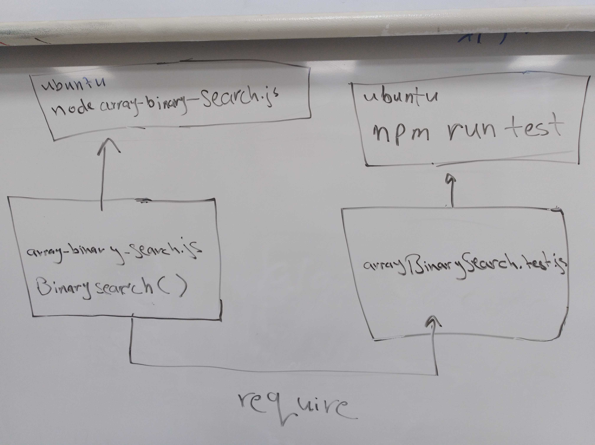

# Challenge Summary
This challeng search over the array to give a valid index of a valid element

## Challenge Description
it should returns the index of the value that passes to the function, and returns -1 if the passed value doesn't match any elements

## Approach & Efficiency
I manage to make a simple function and a simple test for this function to ensure the functionality of it 

For the second commit I refactor the code to use binary search metho

## Solution

