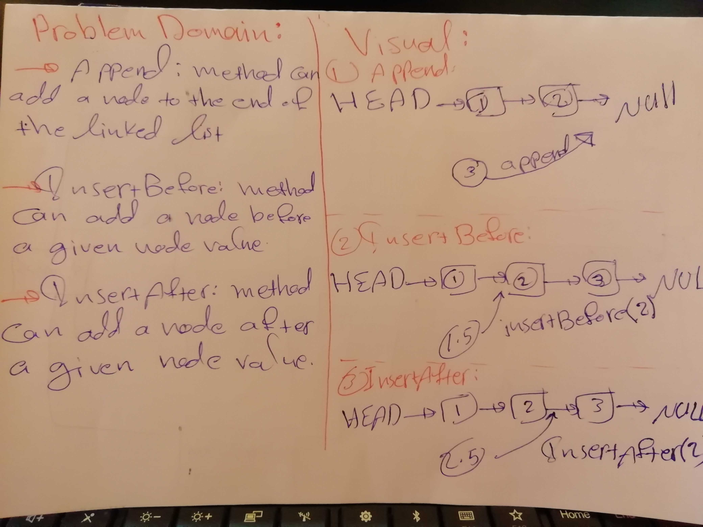

# Challenge Summary
This challenge makes you more familiar with linkedLists and how to do methods on them

## Challenge Description

The challenge asks you to create three methods on the linked list
`append()` : it adds a node to the end of the linked list.
`insertBefore()` : it adds a node to the linked list before the node of a given value.
`insertAfter()` : it adds a node to the linked list after the node of a given value.

## Approach & Efficiency

`insertBefore()` & `insertAfter()` works with big O(n), it moves  from node to node until it reach the demanded node.

## Solution

