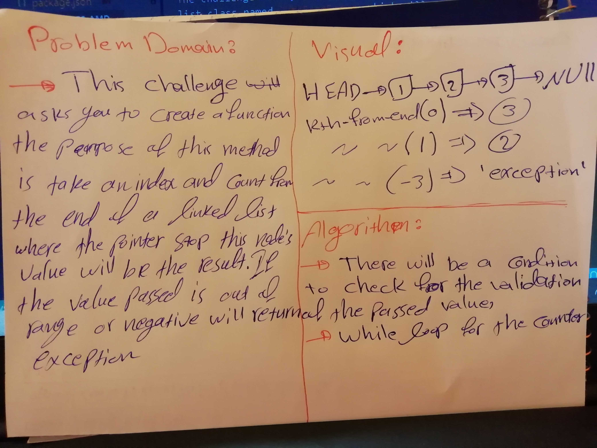

# Challenge Summary
This challenge makes you more familiar with linkedLists and how to do methods on them

## Challenge Description

The challenge asks you to create a method inside your linked list class named `kthFromEnd()` which will count based on the passed value from the end of the linked list and give you back the value of the node where the counter stops, if the the value is negative or out of range will return `exception`

## Approach & Efficiency

`kthFromEnd(k)`: this method is big O(n), because it needs to iterates over each node of the linked list to count the length of it.

## Solution

