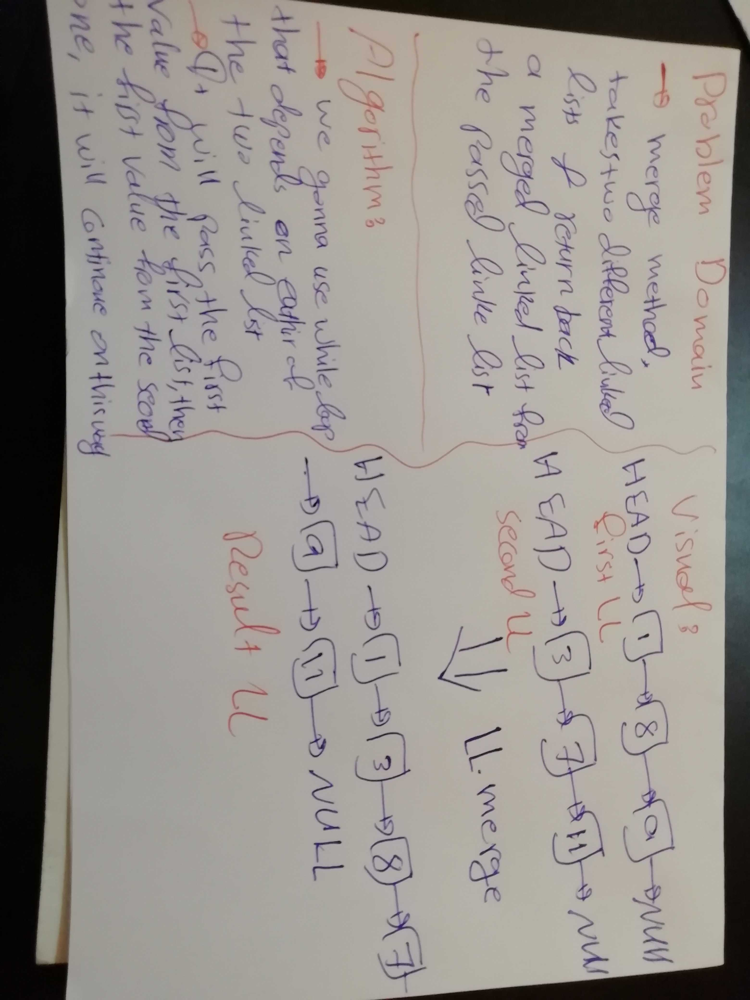

# Challenge Summary
This challenge makes you more familiar with linkedLists and how to do methods on them

## Challenge Description

Here we are going to create a method to our linked list class that will take two arrays as arguments and return a result merged linked list.

## Approach & Efficiency

`mergeLists()`: this method definitely goes with big O(n) because it push every single value of each linked list so `n` will be the sum of the number of the nodes of each list.

## Solution

