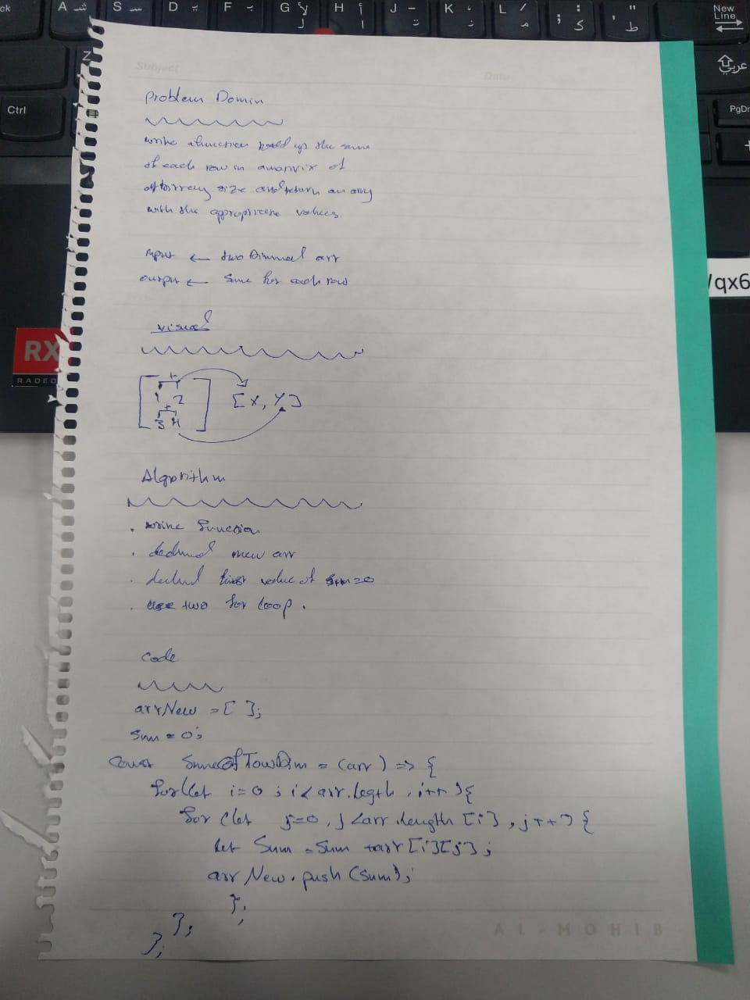

# Challenge Summary

## Challenge Description

* A queue can be implemented using two stacks. Let queue to be implemented be q and stacks used to implement q be stack1 and stack2.

## Approach & Efficiency

- `enqueue` : adding an element to a queue using one array's method (big O(1))
- `dequeue` : removing an element from a queue using two array's methods.(big O(2))

## Solution

