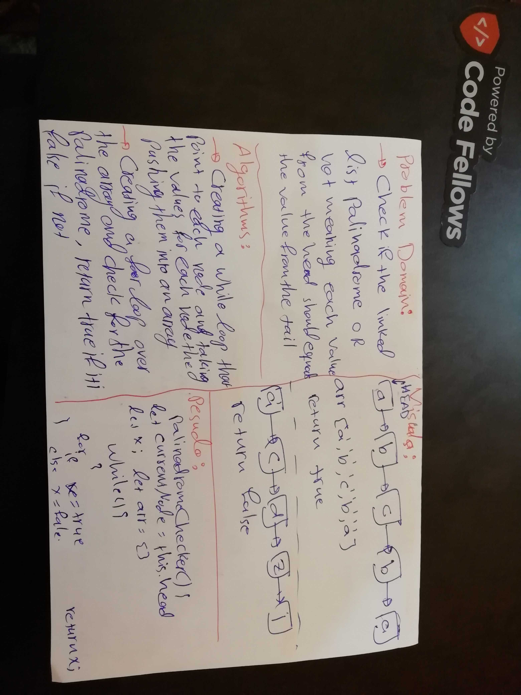

# Challenge Summary

## Challenge Description

* This challnge was an interview with one of my colleague, my challenge was to write a function that check if the linked list is palindrome or not, this function named `palindromeChecker()` 

## Approach & Efficiency

* The function `palindromeChecker()` create an array and take the values of the linked list value and then pass the elements to a loop to check.

## Solution

