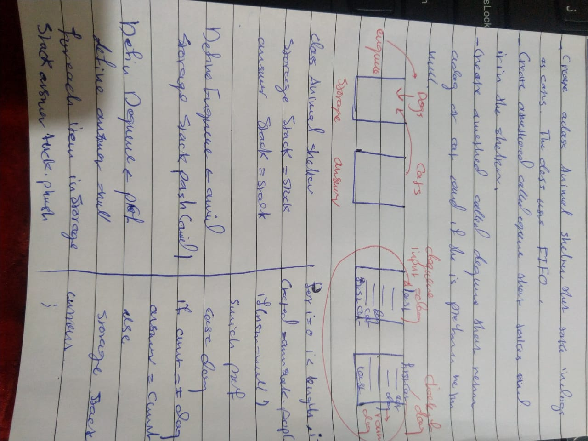

# Challenge Summary

## Challenge Description

* Class named AnimalShelter takes two arrays as its arguments, these two arrays represent the type of animals in that shelter 

## Approach & Efficiency

- `enqueue` : adding an element to a queue (big O(1))
- `dequeue` : removing an element from a queue (big O(1))

## Solution

