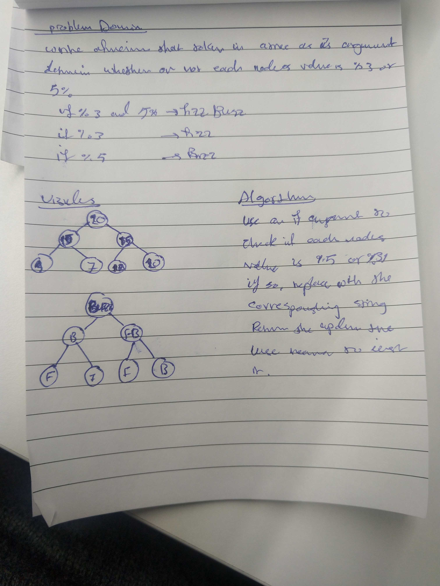

# Challenge Summary

## Challenge Description
The challnge test each value of the tree to change them into Fizz, Buzz, or FizzBuzz

## Approach & Efficiency
This method takes Big O(n)

## Solution

