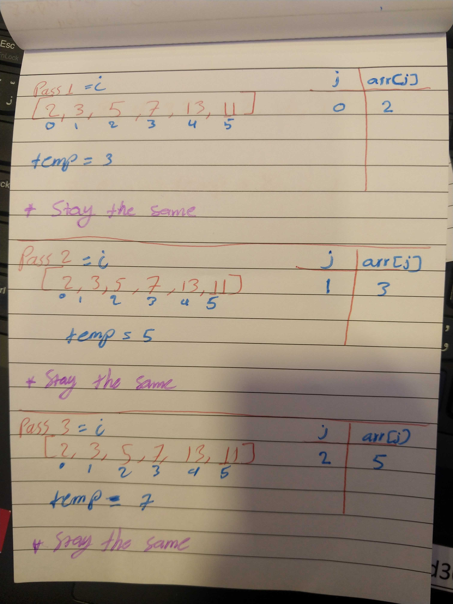
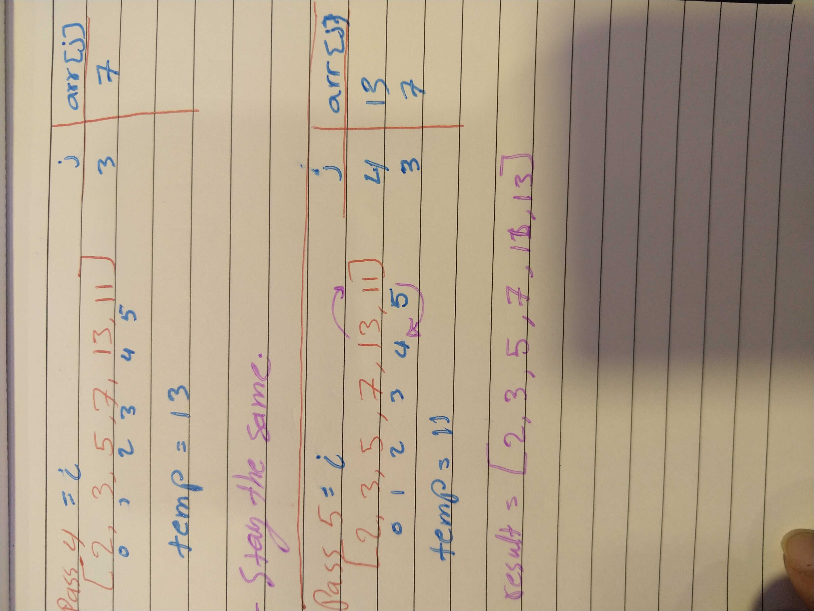

# Challenge Summary

## Challenge Description
- Creating sort method for an array.

## Approach & Efficiency
### `insertionSort(arr)`: 
- time: Big O(n);
- space: Big O(1);
- this method takes an array as its input and return it sorted.

## Solution

